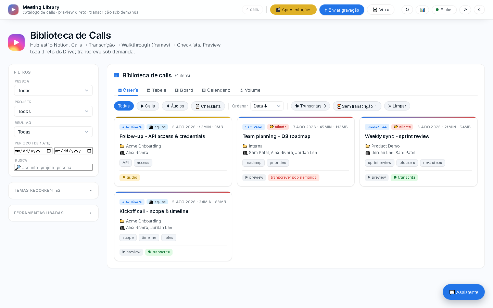

# Meeting Library

**Self-hosted meeting intelligence — record, transcribe, summarize, sync.**



<sub>Screenshots use seeded demo data — no real calls, people, or clients.</sub>

## Why this exists

Most meeting-notes SaaS tools charge a per-seat monthly fee to do something fairly
simple: catalog your calls, transcribe them, and make the content searchable. If
you already run your own infrastructure, there's no reason to pay for that. Meeting
Library is a small, self-hosted panel that does the same job — list and organize
your calls, transcribe them, generate summaries and presentation decks, and sync
everything to Notion — without a subscription, running on a server you control.

## Features

- **Call listing and organization** — a Notion-style library with multiple views,
  search, and per-project checklists
- **Transcription** via AssemblyAI (with speaker labels), plus a Whisper fallback
  for fully offline processing
- **AI-generated summaries and presentation decks** using Gemini and/or OpenAI —
  turn a raw call into a short written recap or a narrated video walkthrough
- **Notion sync** — pulls recorded/transcribed pages from your Notion workspace
  in automatically
- **Simple auth** — invite-code registration, session cookies, no external
  identity provider required
- **systemd-based self-hosted deploy** — runs as a single long-lived process,
  no container orchestration needed

## Tech stack

- **Backend:** Python, standard library only (`http.server` — no framework)
- **Frontend:** plain HTML/CSS/JS (`index.html`, `login.html`), no build step
- **Presentation rendering:** a Remotion template (`presentation-template/`),
  optionally run by a separate worker process
- **Deploy:** systemd service, reverse-proxied by whatever you already run
  (Caddy, nginx, Cloudflare Tunnel, etc.)

## Setup

```bash
git clone <this-repo> /opt/meeting-library
cd /opt/meeting-library
cp .env.example .env
```

Fill in `.env` with your own keys:

| Variable | What it's for | Required |
|---|---|---|
| `AUTH_SALT` | random string used to hash user passwords | yes |
| `INVITE_CODE` | invite code required to self-register | yes |
| `DEFAULT_USER` / `DEFAULT_PW` | bootstrap account created on first boot | yes |
| `ASSEMBLYAI_API_KEY` | call transcription | if transcribing |
| `GEMINI_API_KEY` / `OPENAI_API_KEY` | summaries and presentation content | optional |
| `NOTION_TOKEN` | syncing recorded pages from Notion | optional |
| `SUPABASE_URL` / `SUPABASE_KEY` | offloading frames/transcripts to object storage | optional |
| `ELEVENLABS_API_KEY` | narration for generated presentation videos | optional |

Then run it directly:

```bash
python3 scripts/server.py
```

Or install it as a systemd service (`EnvironmentFile=.env`, pointing at
`scripts/server.py`) so it survives reboots, and enable it:

```bash
systemctl enable --now meeting-library
```

Point your own reverse proxy or subdomain at the configured `PORT` and you're
live. `data/` and `library/` (your recordings, transcripts, and media) are
generated at runtime and are not tracked in git.
